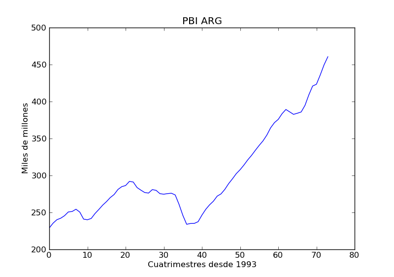
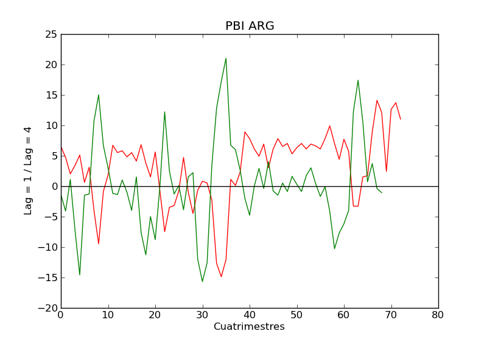
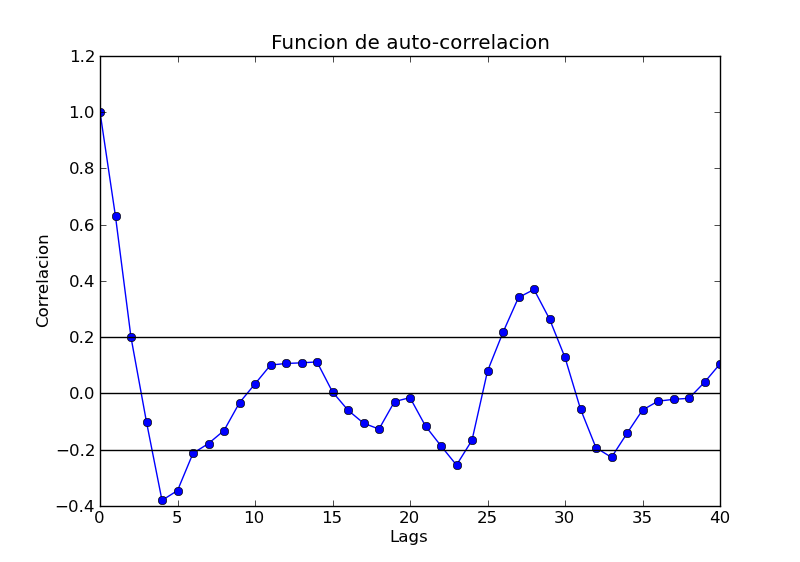
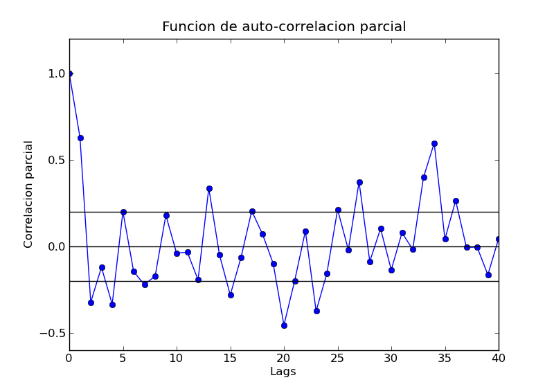

Finanzas cuantitativas con Python
=================================

    por **Damián Avila**
        - email: damianavila@gmail.com
        - web: http://damianavila.blogspot.com
        - twiter: `@damian_avila <https://twitter.com/damian_avila>`_

En los últimos 10 años se han desarrollado diversos proyectos que hacen de
Python un **“instrumento de elección”** para la investigación en finanzas cuantitativas. En
esta pequeña reseña, nos proponemos no sólo hacer una breve descripción de las
herramientas disponibles en Python para el análisis y el modelado de las series
de tiempo, sino también presentar la integración de estas herramientas en un
**“ambiente pythonico”** donde podemos realizar nuestras investigaciones de una
manera simple y eficiente.

¿Por qué usar Python para resolver problemas en finanzas cuantitativas?
-----------------------------------------------------------------------

Existen múltiples plataformas sobre las cuales pueden desarrollarse modelos
estadístico-matemáticos y aplicarlos a los mercados financieros. Entre ellos
podemos citar plataformas comerciales (MATLAB, Eviews, Stata, SPSS, SAS),
plataformas gratuitas de código cerrado (EasyReg) y plataformas gratuitas de
código abierto (R y Gretl). Frente a tantas opciones: **¿Por qué elegir Python?**

Python posee diversas características que lo transforman en una excelente
opción para el modelado cuantitativo de los mercados financieros. Es un
lenguaje interpretado (puede utilizarse interactivamente), es gratuito y de
código abierto, posee múltiples “baterías adicionales” que lo potencian
enormemente y, finalmente, Python es fácil a aprender y usar (de yapa...
¡Es divertido!).

¿Cuales son las “baterías adicionales” necesarias para las finanzas cuantitativas?
----------------------------------------------------------------------------------

* **Numpy** (http://numpy.scipy.org): Extiende Python con un nuevo objeto, a
  saber, los arreglos multidimensionales (con métodos avanzados de corte y
  reorganización). Además contiene 3 librerías con rutinas numéricas (álgebra
  linear, Fourier y números aleatorios) y está escrito mayoritariamente en C
  (por lo que puede extenderse con código escrito en C y Fortran).

* **Scipy** (http://www.scipy.org): Extiende Python con herramientas
  computacionales para científicos. Está desarrollado sobre Numpy y provee módulos
  para estadística, optimización, integración numérica, álgebra lineal,
  transformadas de Fourier, procesamiento de señales, procesamiento de imágenes,
  resolución de ODE y otras funciones especiales específicas.

* **Matplotlib** (http://matplotlib.sourceforge.net): Extiende Python con
  gráficos 2D de gran calidad. Se pueden generar diferentes tipos de gráficos:
  puntos, lineas, barras, histogramas, espectros, etc. Además poseemos un
  control total sobre el estilo, las fuentes y los ejes, a través de un conjunto
  de funciones tipo Matlab (o, a través de una interfase orientada a objetos).

* **IPython** (http://ipython.org): IPython facilita el uso de Python de manera
  interactiva a través de consolas que soportan la visualización
  de datos y el completado por *<TAB>*. Además es una plataforma de procesamiento
  en paralelo.

* **Statsmodels** (http://statsmodels.sourceforge.net): Extiende Python con un
  conjunto de clases y funciones para la estimación de múltiples modelos
  econométricos (provee una detallada lista de estadísticos para cada
  estimador). Permite la exploración descriptiva de los datos y la inferencia a
  través de la realización de múltiples test.

  Algunas de las herramientas emblemáticas disponibles en Statsmodels:

    * Regresión: OLS, GLS (incluyendo WLS y AR-LS).
    * GLM: modelos lineales generalizados.
    * RLM: modelos lineales robustos.
    * Discretemod: Regresión con variables dependientes discretas, Logit,
      Probit, MNLogit y Poisson, basados en estimadores de máxima verosimilitud.
    * Análisis de series de tiempos univariable: AR, ARIMA.
    * Estadísticas descriptiva y modelos de procesos.
    * VAR: modelos de vectores auto-regresivos.
    * Datasets: ejemplos y testeo.

¿Cómo podemos integrar todas estas herramientas disponibles?
------------------------------------------------------------

**Una de las posibles respuestas:** Spyder (http://packages.python.org/spyder)

Spyder (Scientific PYthon Development EnviRonment) es, no sólo un “environment”
de desarrollo con herramientas avanzadas de edición, testeo interactivo y
debugging, sino también, una plataforma para cálculo científico (no sólo
restringido a las finanzas cuantitativas) gracias a la integración de Numpy,
Scipy, Matplotlib e IPython en una “lugar común” al alcance de todos.

Un pequeño ejemplo...
---------------------

Ahora que conocemos algunas de las herramientas disponibles, un poco de acción...

**¿Qué es un cupón atado al PBI?**

Es un instrumento financiero que cotiza en la bolsa y que paga (a año vencido)
un “excedente” que depende (esencialmente) del PBI real, la inflación y el tipo
de cambio.

**¿Es el TVPP (uno de los cupones atados al PBI) una alternativa de inversión
interesante a mediano-largo plazo?**

Para responder esa pregunta trataremos de modelar la evaluación temporal del PBI
(el principal determinante del pago) a través de un proceso auto-regresivo
lineal (univariado).

**NOTA_1: Se darán por conocidos algunos conceptos básicos del análisis de series
de tiempo con el objetivo de ejemplificar un tipo de análisis que “normalmente”
se realiza en finanzas cuantitativas.**

Para ello, “dibujamos” la serie (que obtuvimos previamente online) usando
funciones de matplotlib:

.. code-block:: python

    import matplotlib.pyplot as plt

    TVPP = …

    plt.figure()
    plt.title(PBI ARG)
    plt.xlabel("Cuatrimestres desde 1993")
    plt.ylabel("Miles de millones")
    plt.plot(TVPP.close)

    plt.show()

Asimismo, diferenciamos en orden 1 (linea roja) y orden 4 (linea verde) para obtener retornos y
desestacionalizar, respectivamente.

.. code-block:: python

    ret_close = [] # retornos (lag_1)

    for i in range(1, n-1):
        ret_close.append(TVPP.close[i] - TVPP.close[i-1])

.. code-block:: python

    des_close = [] # retornos desestacionalizados (lag_4)

    for i in range(4, n-2):
        des_close.append(ret_close[i] - ret_close[i-4])

.. code-block:: python

    ar_des_close = np.array(des_close) # convertir lista en np.array

Luego, verificamos la obtención de una serie de tiempo débilmente
**ESTACIONARIA** (ADF test).

.. code-block:: python

    adftest = sm.tsa.adfuller(ar_des_close, None, "c")

    (-4.5919718832856455, 0.00013364295285426029, 2, 66,
    {'5 %': -2.9064436883991434, '1 %': -3.5335601309235605,
    '10 %': -2.590723948576676}, 359.65601420392511)

Calculamos ACF y PACF (funciones de autocorrelación y autocorrelación parcial)
para determinar algunas características esenciales del modelo (y que tienen que
ver con la información “subyacente” en los “valores previos - lags”).

.. code-block:: python

    auto_corrtest = sm.tsa.acf(ar_des_close)

.. code-block:: python

    pauto_corrtest = sm.tsa.pacf_ols(ar_des_close)

Finalmente, estimamos los parámetros del modelo por “fiteo” de la serie de tiempo.

.. code-block:: python

    ARmodel = sm.tsa.AR(ar_des_close)
    ARmodel_fit = ARmodel.fit(maxlag = 4)

Con el modelo “fiteado” podemos pasar a la siguiente fase: el “forecasting”
(es decir, tratar de predecir cómo evolucionará el PBI en los próximos
trimestres).

.. code-block:: python

    ARmodel_fore = ARmodel.predict(n = 10, start = -1)

    [-4.57970687 0.02294563 -0.52401676 -0.05539513
    0.90010725 1.02408095 1.06120815 1.04202971 0.71406367
    0.43024225]

Así llegamos a “forecastear” el PBI 2011 y PBI 2012 en  **~10,5%** y **~9,2 %**.

**NOTA_2: Para valuar el cupón existen otras consideraciones teóricas
adicionales que no se tratarán en este artículo.**

Teniendo en cuenta que el valor del TVPP (x100) en el mercado (al 22-09-2011, el día previo a la
PyConAr 2011) fue de $14,78, considerando el PBI registrado en el 2010 y los PBI que hemos proyectado para 2011 - 2012, tendríamos
la siguiente progresión de pagos:

* **15/12/2011:** $5,97 (asegurado)
* **15/12/2012:** $9,61 (muy probable)
* **15/12/2013:** $14,03 (probable)

Por lo tanto, con los próximos dos pagos pagos lograríamos cubrir la cotización
de los cupones en el mercado al 22-09-2011 ($5,97 + $9,61), y todos los pagos
posteriores (si los hubiere) serían “libres de riesgo”. Podemos concluir
entonces que en el mediano-largo plazo, la compra de cupones atados al PBI
parece un opción atractiva.

**NOTA_3: Este ejemplo NO es una recomendación de compra de activos financieros,
sólo se trata de un ejercicio para demostrar las funcionalidades econométricas
de las librerías que hemos mencionado previamente.**

Conclusiones finales
--------------------

¿Tenemos un “environment” completo en Python para realizar investigación en
finanzas cuantitativas?

En la actualidad, tenemos un “environment” amplio, potente y, además, con mucho
potencial, a través, no sólo de mejoras en la “baterías “ que hemos reseñado,
sino también, a partir de la posibilidad de integración de nuevas “baterías” que agregarán
nuevas funcionalidades específicas para el área.

Sobre el autor
--------------

Damian Avila es analista en finanzas cuantitativas, pero también Licenciado en
Bioquímica (doctorando en ciencias biológicas) de la UNLP.

Utiliza Python (con baterías adicionales específicas) para el análisis de
series de tiempo financieras y para la construcción de modelos matemáticos en biología.

Es docente universitario en la Cátedra de Inmunología en la FCE - UNLP y dicta
cursos de Bioestadística en el Colegio de Bioquímicos - Colegio Zonal XII -
Buenos Aires.

Es miembro de Python Argentina (PyAr - http://python.org.ar/pyar/) y del
Quantitative Finance Club (QFClub – http://qfclub.wordpress.com/).

Sobre la nota original
----------------------

Este artículo aparecio publicado originalmente en la edición número *5* de la
revista "PET: Python entre todos" (http://revista.python.org.ar). El autor
accedio al relicenciamiento para este libro.
