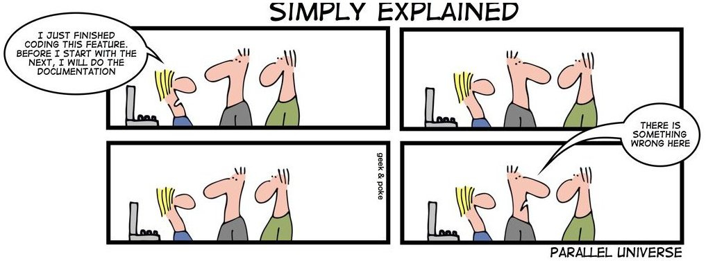

Diseño de APIS en Python
========================

    por **Juan B Cabral**
        - email: jbc.develop@gmail.com
        - web: http://jbcabral.com
        - twiter: `@juanbcabral <https://twitter.com/juanbcabral>`_

Todos sabemos que las librerías son fragmentos de código que **usamos para
resolver problemas comunes**, las cuales podemos asumir como una caja negra
que no sabemos **cómo**  hacen su tarea, pero si **que** es lo que hacen.
Podríamos decir que una librería nos da un poco de **desconocimiento**
(**clueless** en ingles) sobre la solución de un problema.

Si bien este artículo no versa exclusivamente sobre prácticas para aplicarse a
Python y puede aplicarse a toda la variedad de lenguajes de programación
hay varios ejemplos que estan atados a la sintaxis del lenguaje de la víbora.

Muchos de los consejos y ideas que se exponen pueden encontrarse ejemplificados con
Java en el libro "Practical API Design" [#]_ , el cual sugiero como lectura si se desea
interiorisarse en el diseño de APIs.

Definiciones Previas
--------------------

A las funcionalidades de una librería las accedemos a través de las API, la cual
es la descripción de la librería, y es lo que llamamos para alcanzar el objetivo
por el cual decidimos incorportar la librería a nuestro proyecto.  Una buena API
tiene un **"correcto nivel"** de **"clueless"** (la clave es que le nivel tiene
que ser **correcto**).

Como dato anecdótico un subtipo de APIs son los **SPI**. Los cuales son
funcionalidades que hay que extender o implementar para alcanzar un objetivo.
Son la interfaz de un programa con un plugin. Un ejemplo de un **SPE** son los
métodos que nos obliga a definir una clase abstracta.

.. code-block:: python

    import abc

    # ABCMeta es parte del API del modulo abc
    class AbstractClass(object):

        __metaclass__ = abc.ABCMeta

        # Esta funcion es publica y se expone como parte del API de una
        # instancia de AbstractClass
        def public_function(self):
            pass

        # Esta funcion es publica y se expone como parte del API de una
        # instancia de AbstractClass
        def another_public_function(self):
            pass

        # Esta funcion NO es publica y NO es parte parte del API de una
        # instancia de AbstractClass
        def _private_function(self):
            pass

        # Esta funcion es publica y obliga a su redefinicion en una subclase
        # de AbstractClass por lo cual corresponde al SPE de la clase
        @abc.abstractmethod
        def abs_method(self):
            pass

Clueless
--------

.. figure::  libs/abstraction.png
   :align: center

   No Clueless (http://xkcd.com/676/)

El chiste anterior muestra de una manera irónica y cínica que sucede cuando
vemos una solución informática sin un correcto nivel de clueless, pasando
por cada nivel de abstracción disponible en el sistema.

Así el principio de **clueless** se basa en un idea muy simples:
**La ignorancia es un beneficio**; la cual nos ayuda a enforcarnos en el problema
a solucionar y no nos dispersa en **rediseños de ruedas**, que en general ya
cuentan con soluciones bien realizadas en librerías ya existentes que vamos a
usar sin que nos importe conocer su funcionamiento interno.

Cabe aclarar que es una idea que para quedarse (y es en cierta medida lo que
provee las **n** capas de abstracción sobre el hardware que hoy tenemos),
y que **NO** significa "no saber", sino, no preocuparse en lo que es el **core**
de de tu programa y no funcionalidades ya existentes.

Como último detalle aclaramos que Python es altamente "clueless"
ya que nos evita pensar en cosas de bajo nivel que otros lenguajes no.

Zen Vs. Zen
-----------

Las librerías al menos contradicen de alguna manera el "zen" de Python en los
siguientes puntos:

- **Explicit is better than implicit:** Ya que ocultamos cierta
  funcionalidad adentro de un tipo de "caja negra".
- **Flat is better than nested:** La funcionalidad se encuentra anidada
  en la "caja negra" antes mencionada.
- **Special cases aren't special enough to break the rules:** Si
  consideramos a Python pelado como la forma "común" de hacer las cosas,
  utilizar una solución de terceros sería no utilizar la forma común,
  entonces estaríamos frente a un caso especial donde no utilizamos las
  reglas comunes de solución de problemas.
- **There should be one-- and preferably only one --obvious way to do it:**
  Muchas librerías que resuelven un mismo problema existen
  (django, web2py, bottle, etc) por lo cual no hay una sola forma evidente
  de hacer las cosas.

¿Por qué es importante recordar estos puntos?, sencillamente porque ayudan a
tomar decisiones de qué librería usar para cada problema, es importante
asumir que cuando nos decidimos a utilizar una librería (o diseñarla) estamos
atando nuestro curso de trabajo futuro a una forma **no estándar**, que es lo
que intenta prevernirnos el Zen de Python. Así que pensar en utilizar o diseñar
una librería es un punto bastante crítico a tener en cuenta; así como también
es importante recordar estos (otros) aformismos también presentes en el Zen que
evitan que caigamos en:

- **Although practicality beats purity:** Es mucho mas práctico utilizar una
  librería que empezar a escribir todo desde cero.
- **Namespaces are one honking great idea -- let's do more of those!**
  Las librerías son los espacios de nombres mas cómodos de utilizar ya que
  se mantienen totalmente ajenos a nuestro desarollo

Así que dado que hay cosas contradictorias en las decisiones de diseños de
API's y librerías voy a continuar dando unos consejos útiles a la hora de tomar
la decisión de encarar un proyecto de este tipo para que se ajuste
lo mejor posible a los principios del "estandaridad" de uso que plantea el Zen de
Python.

Consejos
--------

**Exponer solo los métodos necesarios**: Tratar de exponer muchos
métodos, clases, funciones y variables públicos puede confundir al usuario de
tu API. Tratar de mantener las llamadas públicas justas, que sirvan para dar
la funcionalidad de la librería y no mucho mas. Tampoco hay que excederse con esto
ya que si dejamos muy rígida nuestra librería, por la falta de comportamiento
público puede que en algunos casos se vuelva inútil. En definitiva, debería
cumplirse esto:

.. code-block:: python

    >>> len([n for n in dir(obj) if not n.startswith("_")])
    (numero pequeño)

**No exponer jerarquías profundas:** No es lo mismo diseñar para la API que
para reusar código. Exponer una gran cantidad de clases anidadas no suele ser
útil al momento de solucionar un problema sin interesarnos en "cómo" se soluciona.

**Cooperación con otras APIs:** Nuestras librerías no están solas en el mundo,
eventualmente se van a conectar con otras librerías de terceros y desde su
concepción están conectadas, casi con seguridad, con la standar library de Python.
Por estos motivos es que es importante mantener cierta "estandaridad" para
lograr el Principio de menor sorpresa [#]_ en los usuarios. Para lograr esto
es recomendable:

- Seguir la PEP 8 [2].
- Si usamos librerías de terceros evitar retornar objetos de la misma,
  excepto que nuestra librería necesite evidenciar ese acoplamiento (una
  app en Django seria un buen ejemplo).
- Ser cuidadoso en no redefinir comportamiento de otras APIs ya que aumenta
  el acoplamiento.

**Mis tipos, tus tipos:** Es mala idea exponer objetos de uso interno en las API,
si esto es realmente necesario es buena idea que estos objetos tengan
comportamiento muy similar a los de la biblioteca estándar. Así, si usamos algún
tipo de colección iterable ordenada internamente, estaría bueno que se comporte
como cualquier lista o tupla de Python (los query sets de Django cumplen esta
idea).

Este principio también aplica a los formatos "estándar" de transferencia de
datos

- **XML:** Trabajar con xml implica conocer muchas más cosas que la sintaxis
  del lenguaje; como ser: W3C DOM, XPath, XSL y otras apis que andan dando
  vuelta por ahi. Moraleja: XML debería tratar de no utilizarse.
- **JSON/YAML:** Mapean directamente sobre objetos del lenguaje que estemos
  utilizando (Python para nuestro caso) y no necesitamos más que conocer
  el manejo tradicional de listas y diccionarios para utilizarlos (y en el
  caso de YAML da un poco más de flexibilidad) lo cual hace que estos
  formatos posean un api más consistente con nuestra aplicación.

**Controles de Tipos:** Si bien Python posee Duck Typing los tipos de datos
no esperados pueden causar serios dolores de cabeza en las librerías si no se
validan lo antes posible. Por poner un ejemplo sencillo:

.. code-block:: python

        >>> def foo(a, b):
                c = a + b
                d = c * 2
                return d / 5

        >>> print foo(1, 2) # [1]
        1

        >>> print foo("hello", "world") # [2]
        Traceback (most recent call last):
          File "ej.py", line 9, in <module>
            print foo("hello", "world")
          File "ej.py", line 4, in foo
            return d / 5
        TypeError: unsupported operand type(s) for /: 'str' and 'int'

En el código anterior se ve como si bien la llamada a la funcion ``foo`` en
**[1]** funciona a la perfección, el error que se muestra al ejecutar **[2]**
realmente no radica (conceptualmente hablando) en la línea que dice
``return d / 5`` sino en que ``foo`` jamás espero que un string llegue como
argumento. Dado que los controles de tipos llevan tiempo, utilizar
la sentencia **assert** es buena idea para este trabajo, ya que pasando
los test correspondientes con solo correr Python en modo optimizado en ambiente
de producción (``$ python -O``) estas líneas no se ejecutaran. Nuestro
ejemplo anterior entonces quedaría algo como:

.. code-block:: python

    >>> def foo(a, b):
        assert (a, (int, float))
        assert (b, (int, float))
        c = a + b
        d = c * 2
        return d / 5

Una última precaución a tener en cuenta es ser cuidadoso con los valores
por **defecto** que se le da a las variables.

**Errores** Llamamos errores a algo inmanejable por nuestra librería y no
a algo que Python considera un error. Así si python al tratar de abrir
un archivo falla con un ``IOError`` puede que nuestra librería genere valores
por defecto y continúe operando normalmente con lo cual dado nuestro dominio
no implicaría un error.
Se debe tratar los errores lo más tempranamente posible, totalmente lo opuesto
a lo que sucede con la validación de tipos que se hacen a nivel de API, siempre
teniendo en cuenta que **Errors should never pass silently,**
**Unless explicitly silenced.**

Crear excepciones propias puede ser un arma de doble filo para nuestra
librería ya que aumenta la capacidad de manejar errores desde la
aplicación cliente pero Disminuye la homogeneidad con las **pilas**.

**Inmutabilidad Rulz!** Dado que a esta altura dijimos que tenemos que controlar
todos los parámetros que llegan, todos los valores de retorno y todos los errores;
Si llegamos a la necesidad de exponer objetos nuestos en nuestra API, al definirlos
es buena idea intentar que sean inmutables.

Hacer objetos inmutables de alguna manera es darle todos los derechos de
modificación al contructor (``__init__``) por lo cual toda validación que se
necesite hacer de parámetros de entrada, esta concentrada en un solo lugar con
lo cual ahorramos muchos dolores de cabeza.

Ya decidido si un objeto nuesto va a ser mutable o inmutable solo queda aclarar
unas pequeñas cosas:

- Si un objeto es **inmutable**:
    -TRATAR de redefinir ``__repr__``,  ``__str__``, ``__hash__``,
     ``__cmp__``, ``__eq__`` y ``__ne__``.

- Si un objeto es **mutable**:
    - Controlar mucho lo que llega por las API.
    - Redefinir: ``__repr__``,  ``__str__``, ``__cmp__``, ``__eq__`` y
      ``__ne__``.

**Cuetiones de Diseño:** Siempre planeen primero la funcionalidad o lo
que es lo mismo decir: Primero el controller en MVC. O lo lo que es lo mismo
**TDD**. Si bien en nuestra vida cotidiana es muy común que decidamos comprar
nuestras cosas en función de una necesidad puntual, como programadores casi
siempre cometemos el error de plantear primero "la cosa" y luego tratar de
encontrarle una utilidad a lo que programamos. Es mucho más fácil y sencillo
primero plantear un test. y al primer intento de correrlo evidentemente va a
fallar por que estamos testeando algo que no construimos. Cuando dejamos
de desarrollar... cuando el test pasa (acompaña esta revista una larga nota
sobre diseño de MVC sobre las ideas de Maurice Merleau-Ponty el cual justifica
de una manera filosófica el por que del TDD).

Sumado al TDD es también buena idea plantear inicialmente el nivel de
excelencia que se quiere llegar nuestro proyecto y no simplemente liberar la
primer versión cuando uno se aburre.

**Portando** Esencialmente hay dos formas de encarar el port de una librería en
otro lenguaje a Python:

* **Facilitar a la vida a los desarrolladores Python** con lo cual hay que
    - Respetar pep8: ``assertTrue -> assert_true/ asserttrue``
    - Utilizar funciones de Python: ``obj.length() -> len(obj)``
    - Utilizar métodos de Python: ``obj.appendChild(aobj) -> obj.append(aobj)``

* Facilitar a los usuarios que vengan del lenguaje de la librería original
  y quieran la misma funcionalidad en python, con lo cual lo ubico que hay
  que decir es que **Python no es Java** [#]_

**No publiquen sus librerías sin tests:** Nada garantiza que lo que ustedes
hicieron funcione en otros ambientes. Integrar los test a herramientas como
setuptools es muy sencillo, y evita dolores de cabeza.

**Publiquen sus librerías de manera comunes a los developers Python**  Si bien es
bueno tener paquetes para todos los OS, prefieran cosas como PyPi que sus
principales usuarios van a ser los propios desarrolladores.

**No publiquen sus API sin documentación:** Algo sin documentación es algo que
no es usable, o en el peor de los caso obliga a sus usuarios a releer su código
con lo cual quitan lo mas importante de un API (el cluelees). La documentación
no sólo tiene que estar completa, sino de preferencia integrada y en el idioma
de Shakespeare (aunque sea un mal Inglés).

   Documentación (http://geekandpoke.typepad.com/geekandpoke/2011/09/simply-explained-2.html)

**Las APIs simétricas son buena idea:** Una api simétrica es una que puede
hacer algo en los dos sentidos, por ejemplo: Parsear JSON y generar JSON. Que
una api sea simétrica aumenta mucho la estabilidad de un proyecto ya que resulta
mucho mas simple testearlo. Por ejemplo una sencilla prueba de PyYaml
sería algo como:

.. code-block:: python

        import random
        import unittest
        import yaml

        class TestA(unittest.TestCase):
           "el test es super sencillo y muy trivial"

            def setUp(self):
                # creamos un diccionario random
                self.data = dict((k, str(random.randint(1, 10000)))
                                  for k in range(1000))

            def test_y(self):
                #testeamos el dump y el load de yaml
                self.assertEquals(yaml.load(yaml.dump(self.data)), self.data)

       unittest.main()

**La retrocompatibilidad es un compromiso:** Si bien la mantención de código
viejo puede ser tedioso y desde algunos puntos de vista inútil; al hacer algo
público en nuestra API, estamos firmando un contrato con quien utiliza nuestra
librería; con lo cual la decisión de eliminar código viejo público no es algo
que debe hacerse a la ligera y es buena práctica deprecar lo que este pensando
en eliminarse en versiones con anterioridad a la purga.

Conclusión
----------

Todo buen diseño no deja de ser una cuestión subjetiva y puede que muchos de
los lectores de esta nota no estén de acuerdo con cosas que aquí expongo, pero
muchas de estas notas pueden ser buenos puntos de partida y mientras se evite
el monkeypatch y no se abuse de los patrones, lo demás queda a juicio del
cada alma libre.

Sobre el autor
--------------

Juan es Ingeniero en sistemas y ejerce como analista programador.
Entusiasta del Software libre Python, y la estadísticas.

Sobre la nota original
----------------------

Este artículo aparecio publicado originalmente en la edición número *5* de la
revista "PET: Python entre todos" (http://revista.python.org.ar). El autor
accedio al relicenciamiento para este libro.

.. [#] Jaroslav Tulach, **"Practical API Design: Confessions of a Java Framework Architect"**,
        Apress; 1 edition (July 29, 2008), ISBN-10: 1430209739, ISBN-13: 978-1430209737
.. [#] http://en.wikipedia.org/wiki/Principle_of_least_astonishment
.. [#] http://dirtsimple.org/2004/12/python-is-not-java.html
