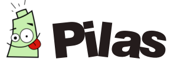
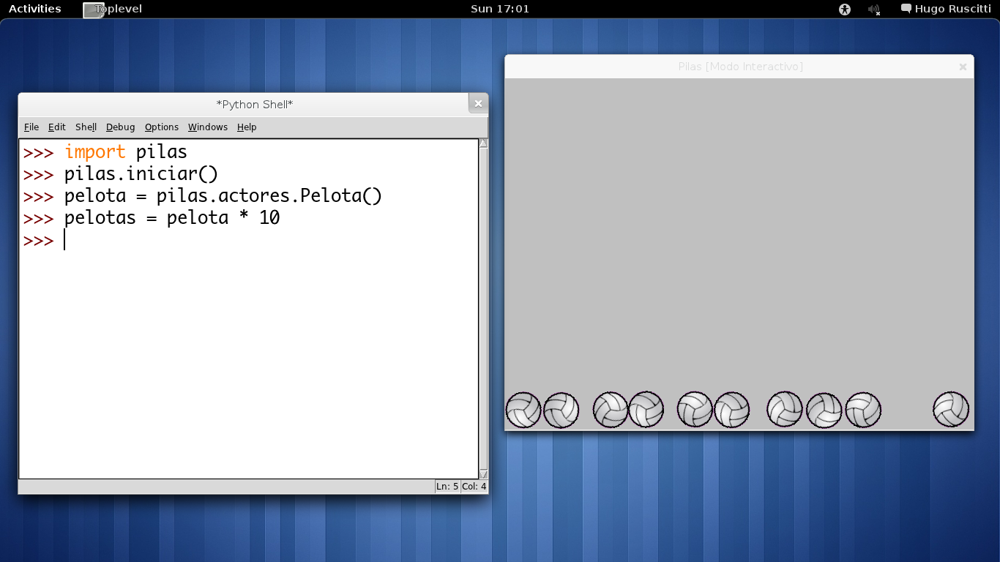
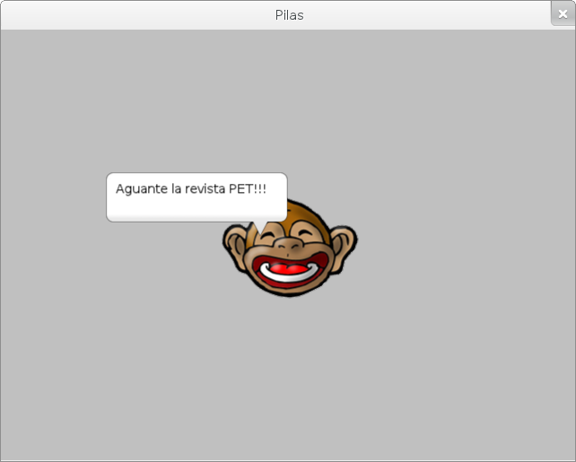
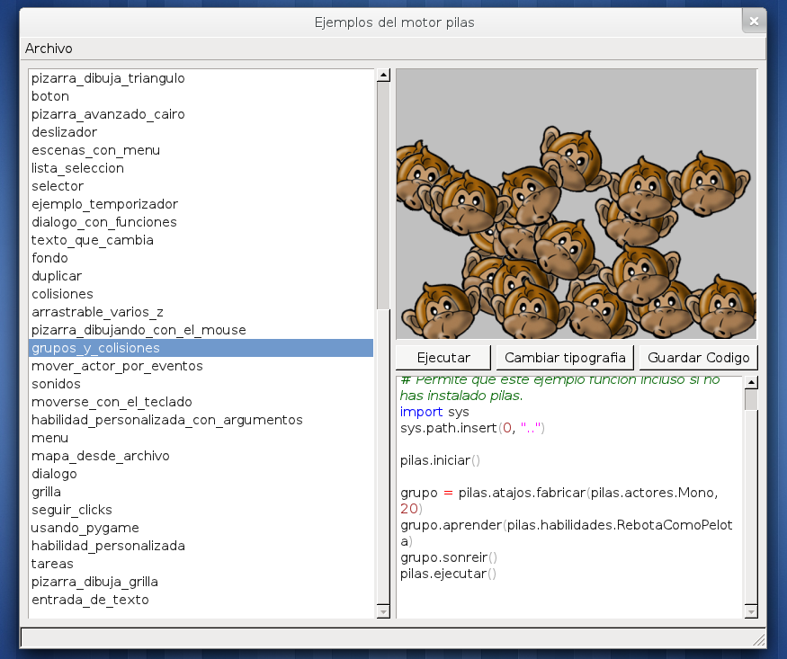

Pilas Engine
============

    por **Hugo Ruscitti** <hugoruscitti@gmail.com>

En este artículo quiero contarles brevemente
algo sobre el desarrollo de videojuegos, por qué
me parece una idea interesante para llevar a
las escuelas y cómo se pueden poner en práctica
haciendo videojuegos fácilmente.

¿Por qué hacer videojuegos?
---------------------------

Desarrollar videojuegos es una actividad super interesante,
consiste en llevar adelante un proyecto, darle vida a una
idea, contar una historia y poner en práctica un montón
de conceptos útiles sobre computadoras, matemáticas,
literatura, física, etc.

Y también están dirigidos a un público, porque
los videojuegos en sí, son muy llamativos, a todas
las personas que le cuento sobre videojuegos
le encanta la idea, y se suelen entusiasmar mucho
compartiendo cómo se divierten o divirtieron con tal
o cual videojuego.

Por ese motivo, creo que podemos comenzar a ver
a los videojuegos como algo mas completo que solamente
diversión. Porque también es una oportunidad muy
valiosa para aprender y despertar el interés
de los chicos en las aulas.

Es mas fácil de lo que parece
-----------------------------

Pero casi siempre que hablamos de programación,
muchas personas se tienen que enfrentar a muchos
miedos y pre-conceptos algo desacertados. Hace algún tiempo
realizar programas era una tarea muy compleja, pero
hoy no es así.

Por suerte Python, junto a bibliotecas de alto nivel
y el acceso a la tecnología están dando a
las personas cada vez mas herramientas para hacer
cosas creativas y novedosas con sus computadoras.

Pilas
-----

**Pilas** es una biblioteca desarrollada para facilitar
el desarrollo de videojuegos a todas las edades.

Está orientado principalmente a los mas jóvenes, que
recién descubren las computadoras y quieren hacer
algo creativo con ellas.

Creando una ventana y muchos actores
------------------------------------

Veamos un ejemplo desde la consola
interactiva de python: ``pilas`` se utiliza como
cualquier módulo que podemos incorporar y comenzar a utilizar
así:

.. code-block:: python

    import pilas
    pilas.iniciar()

La función ``iniciar`` se encarga de abrir una
ventana, y nos ofrece algunos argumentos opcionales
por si queremos especificarlos (este no es el
caso.)

Una vez que tenemos la ventana, podríamos crear
algún personaje animado para tener algo de acción:

.. code-block:: python

    pelota = pilas.actores.Pelota()

Lo que veremos en la pantalla es una pelota de
volley rebotando por si sola, sobre el suelo. Y si
queremos que rebote con alguna otra cosa
podríamos multiplicarla, para tener un montón
de pelotas rebotando:

.. code-block:: python

    pelotas = pelota * 10

¿Y que hay de la gravedad?, se puede cambiar
fácilmente así:

.. code-block:: python

    pilas.fisica.definir_gravedad(10, 30)

Dónde 10 y 30 son la aceleración horizontal y
vertical respectivamente. Por cierto, los valores
habituales suelen ser 0 y -90.

Un ejemplo mas específico
-------------------------

Veamos esto un poco mas en detalle, escribe
``pilas.reiniciar()`` para limpiar lo que tenemos
en pantalla.

Ahora bien, los actores son objetos que viven en el módulo
``pilas.actores``. Por ejemplo si escribimos:

.. code-block:: python

    mono = pilas.actores.Mono()

Aparecerá un monito en el centro de la ventana, y
cómo lo creamos usando una referencia vamos a poder
indicarle cosas cómo las siguientes:

.. code-block:: python

    mono.gritar()
    mono.decir("Aguante la revista PET!!!")

También podríamos alterarle algunas propiedades
visuales cómo su rotación, tamaño, posición, transparencia
etc. Tomemos este ejemplo, vamos a mover al
mono hacia la derecha de la pantalla y
dupliquemos su tamaño:

.. code-block:: python

    mono.x = 100
    mono.escala = 2

¿Notaste que los cambios son inmediatos?, ¿Cómo
hacemos para crear animaciones?. Simplemente tienes
que cambiar los número enteros por listas:

.. code-block:: python

    mono.x = [0]
    mono.y = [200, 0]
    mono.rotacion = [360]

La primer sentencia mueve al mono al centro de la
ventana (horizontalmente), la segunda sentencia
hace que el mono se mueva hacia arriba
y luego hacia abajo. Y la última sentencia
hace girar al mono una vuelta completa.

Todos los actores son objetos
-----------------------------

El ejemplo anterior nos muestra que los actores, en
realidad, son objetos: Tienen propiedades cómo
``escala``, ``x`` e ``y``, pero también tienen
comportamiento, cómo los métodos ``decir`` o incluso
la interpretación de mensajes cómo * (igual
que los números y los strings) cómo vimos
en el ejemplo de la pelota de volley.

Esta es una idea muy poderosa de la programación, porque
significa que cuando logras dominar un actor, en realidad,
estás aprendiendo a manejar muchos actores, y a su vez, estás
programando python!

Investigando
------------

Hay una función de ``pilas`` que viene útil para
comenzar a investigar: la función ``pilas.ver``:

.. code-block:: python

    pilas.ver(mono)

Esta función se puede usar para inspeccionar el código
fuente de cualquier cosa: módulos, funciones, actores,
referencias a objetos a clases etc...
¿cómo funciona?, fácil, hace ``pilas.ver(pilas.ver)``.

Y por supuesto también está la función ``help``
y el auto-completado de código.

Incluso, si escribes ``pilas -e`` en una terminal, observarás
una aplicación que te permite ver todos los ejemplos
de código que incluye pilas:

Mirando hacia el futuro
-----------------------

Creo que estamos ante una posibilidad
interesante de mostrar lo divertido e interesante
que resulta la programación. Una posibilidad
de entregar a las personas una herramienta
muy poderosa para pasar de consumidores a productores
de tecnología.

Sólo que en este punto, no se trata de algo
estrictamente técnico, porque el desafió está
precisamente en difundir, crear y ayudar dentro
de ``pyar`` para que las personas se animen
a participar.

Por ese motivo, si te gustó lo que viste
en este artículo, mi consejo es que te animes
a escribir y contarle a mas personas sobre
el desarrollo de juegos.

Podrías visitar la web de pilas (www.pilas-engine.com.ar),
contarnos por la lista de correo de pyar que te pareció, o
cualquier idea que tengas. Tus comentarios son
muy valiosos para que este y otros proyectos puedan
seguir adelante.

Sobre el autor
--------------

Huro Ruscitti es estudiante de Informática en la  Universidad Tecnológica
Nacional (UTN).

Ha trabajado elaborandodistribuciones de Linux y actualmente es socio de la
cooperativa de trabajo gcoop.

Su mayor hobby es la programación de videojuegos, actividad que difunde y
realiza junto a los miembros de su sitio http://www.losersjuegos.com.ar/
