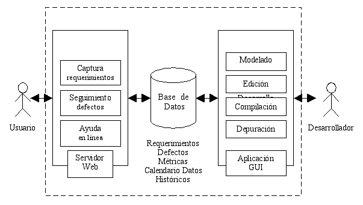
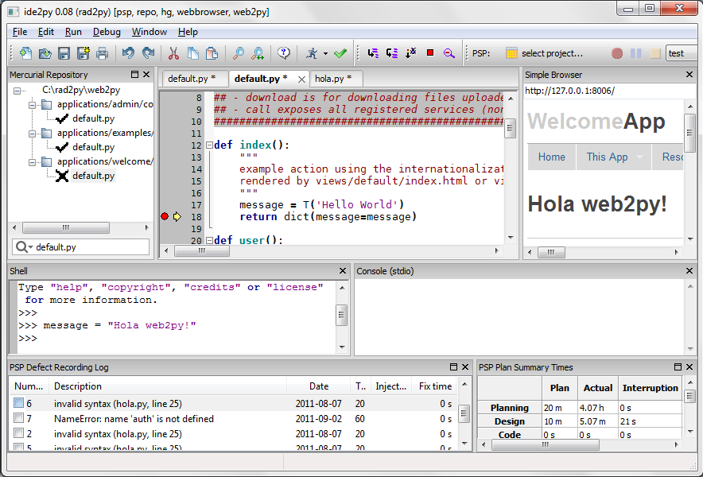

RAD2PY: plataforma Python para el Desarrollo Rápido de Aplicaciones bajo un Proceso de Software Personal
========================================================================================================

    por **Mariano Reingart**
        - email: reingart@gmail.com
        - web: http://reingart.blogspot.com
        - twiter: `@reingart <https://twitter.com/reingart>`_

En el campo del **Desarrollo Rápido de Aplicaciones** (método RAD) comúnmente
existen diferentes **aproximaciones metodológicas, teorías, estándares y buenas
prácticas** para llevar a cabo el Desarrollo de Software; generalmente **sin una
sólida fundamentación científica** o sin basarse en datos empíricos completos e
imparciales, agravándose sobre todo en la búsqueda de soluciones a las **falencias
o riesgos que presenta los enfoques ágiles**.

A su vez, por estas dispersión conceptual, es difícil encontrar una herramienta
(IDE) que de **soporte integral al proceso**, cuestión fundamental para la
efectividad del método, que no puede ser salvada efectiva y eficazmente por
los utilitarios independientes actualmente en existencia (editores, depuradores,
gestores de proyectos, etc.), más allá de la calidad y capacidad de cada uno,
dado que en este caso se confirmaría el axioma **“el todo es más que la suma de
sus partes”**, debido a las propiedades emergentes de dichos sistemas complejos.

Por lo tanto, **RAD2PY** busca definir una base teórica y práctica para **aumentar
la productividad**, resolviendo los problemas asociados al método RAD
(**aseguramiento de calidad**, **mejora continua**); proveyendo una nueva generación de
herramientas integradas guiada por el **Proceso de Software Personal** (PSP), para
encauzar la metodología, **solucionando sus falencias pero sin perder sus beneficios**.

El Desarrollo Rápido de Aplicaciones
------------------------------------

Ya en 1991, James Martin [RAD91]_ argumentó que los desarrolladores pueden
archivar grandes reducciones en tiempo y costo, entregando sistemas de
información de gran calidad al usar métodos modernos que combinan el
**involucramiento extensivo del usuario final** con metodologías modernas de
desarrollo soportadas por **herramientas de diseño asistido por computadora**
(CASE) bien **integradas** (a lo que denomina **I-CASE**).

En relación a los riesgos y viabilidad del método, en un estudio de campo
publicado por la ACM [RADRSK00]_, se destaca que si bien existe evidencia
creciente que apoya a RAD como una **mejora del “orden de magnitud”** en la
velocidad de construcción de software, emergen **implicaciones serias**. En primer
lugar, es importante reconocer que RAD representa un cambio radical, por lo que
se debiera realizar entrenamiento, no solo de conocimientos técnicos, sino
ambién sobre las mejoras radicales que involucra. Mas importante aún, se deben
evitar las capacidades RAD que **deterioran las buenas prácticas** en el desarrollo
de sistemas, ya que solo se puede lograr alta calidad, bajo costo y desarrollo
rápido si se utiliza una metodología de desarrollo (**proceso de software
disciplinado** [RADSTN98]_).

Es por ello que con **RAD2PY** se busca definir una base conceptual sólida, que
permita **desarrollar el método RAD de manera profesional, encuadrado con el
Proceso de Software Personal (PSP)** como lineamiento para definir y encauzar la
metodología de desarrollo, para luego desarrollar una herramienta integrada
(I-CASE) que le de soporte.

Si bien existen otros acercamientos al tema para solucionar los problemas de
calidad, como ser el Método Dinámico de Desarrollo de Sistemas (DSDM)
desarrollado a partir del RAD (SWQ01), que también se basa en enfocarse no solo
en la velocidad sino también en la calidad. Sin embargo, a diferencia del
proceso PSP más tradicional y robusto [MUKESH08]_, no existe **evidencia empírica**
públicamente disponible y consensuada sobre la efectividad del DSDM [AGILDIR03]_.

El Proceso de Software Personal
-------------------------------

El **PSP** fue desarrollado en 1993 por Watts Humphrey [PSP00]_, y es un marco personal y
disciplinado de trabajo para llevar a cabo las tareas de software, que consiste
en una serie de **métodos**, **formularios** y **guiones** que muestran a los ingenieros de
software como planear, medir y administrar su trabajo. La meta del proceso es
producir productos con cero defectos, respetando el calendario y con los costos
planeados.

La efectividad de la metodología PSP fue documentada tanto en entornos
académicos e industriales, ya sea en reportes y artículos técnicos. El resultado
de estos estudios encontró que el PSP **mejoró el rendimiento** (estimación del
tamaño y esfuerzo, calidad de producto y proceso) mientras que **no tuvo
desventajas en cuanto a la productividad** [PSPEMP97]_.

Si bien estos estudios publicados demuestran las ventajas del PSP, diversos
trabajos también señalan ciertos inconvenientes en la recolección manual de los
datos y posterior análisis por parte de los desarrolladores, cuestionando su
exactitud, recomendando que el uso de **herramientas integradas** debe ser necesario
para un análisis de alta calidad de los datos del PSP [PSPDAT98]_.

También se sugiere que si bien los estudiantes aprenden el PSP y logran mejorar
sus procesos, lo abandonan cuando ya no se les requiere utilizarlo. Este
**"problema de adopción"** puede ser producido por dos causas: **sobrecarga de trabajo**
por la recolección y análisis métricas y el **cambio de contexto** (entre la
herramienta de desarrollo y la recolección de métricas). [PSPBEY03]_.

Actualmente existen tres generaciones de herramientas PSP:

Primera generación
    el procedimiento original con guias y plantillas manuales con soporte de
    planillas de cálculo o bases de datos simples.  Su principal inconveniente
    es la sobrecarga de trabajo y poca confiabilidad de los datos recolectados,
    barrera para la adopción del PSP.

Segunda generación
    herramientas independientes para recolección de métricas y cálculo de
    estadísticas, citando como iniciativa destacada al Process Dashboard
    [DASHBOARD11]_. Si bien solucionan parcialmente el problema de la sobrecarga
    de trabajo, introducen nuevos inconvenientes por el cambio de contexto
    (pérdida de concentración al alternar entre la herramienta de desarrollo y
    la herramienta de medición) y sigue dejando a criterio del programador el
    señalamiento de las fases (por ej. inicio y fin de codificación) y
    detección de incidentes (por ej. errores introducidos, errores
    solucionados), pudiendo compromenter la veracidad de los datos recolectados
    (ya sea por error u omisión).

Tercera generación
    corresponden a marcos de trabajo para la medición y análisis dentro de
    procesos de ingeniería de software (in-process software engineering
    measurement and analysis - ISEMA), cuya implementación de referencia más
    destacada es Hackystat  [HACKYSTAT11]_ y consiste en aplicar discretamente
    telemetría (recolección automática de datos), que en teoría solucionaría la
    sobrecarga de trabajo, eliminando las distracciones por cambio de contexto
    y aumentando la confiabilidad de datos. Si bien hay casos que demuestran la
    factibilidad de usar las herramientas automatizadas [AISEMA09]_, su uso no
    se a extendido debido a que introduce nuevos interrogantes relacionados a
    la privacidad de los desarrolladores y a la efectividad de los datos
    recolectados por ser e ocasiones demasiado voluminosos y de muy bajo nivel
    (genericos), dificultando su interpretación en tiempo y forma [ISEMA07]_.

.. figure:: rad2py/proc_dash.png
    :align: center
    :scale: 100%

    Figura 1: Ejemplo del Process Dashboard para la medición de tiempos y defectos

Como solución, para RAD2PY, se plantea **integrar directamente la recolección de
métricas dentro de las herramientas de desarrollo I-CASE del modelo RAD**,
solucionando de este modo los problemas antes planteados, generando una
herramienta PSP de **Cuarta Generación** que integre completamente el proceso de
desarrollo de software para simplificar y sustentar una efectiva disciplina
personal, totalmente automatizada, sin necesidad de programas o tareas adicionales.

Vale aclarar que las herrramientas actuales estan desarrolladas en **Java** y son
**extremadamente complejas**, lo que dificulta cualquier integración en Python.

Arquitectura de RAD2PY
----------------------

Esta investigación se enfocara, en primer lugar, en desarrollar un **Entorno
de Desarrollo Integrado** (**IDE2PY**), que de soporte al PSP (tanto a nivel fases como
recolección de métricas). Para ello, se integrará la cadena de herramientas,
rescatando los puntos sobresalientes de cada una:

    * **IDLE / PythonWin:** entorno integrado, características de edición y depuración integradas.
    * **PyCrust:** facilidades de consola interactiva
    * **PythonCard:** construcción y modelado de GUI (utilizando wxPython)
    * **SPE:** visualizador de objetos y clases UML
    * **PyFlakes:** herramienta para detectar errores (similar a  la compilación de los lenguajes estáticos).
    * **Py2Exe / Freeze:** herramienta de despliegue

En segundo lugar, se desarrollará una herramienta de soporte y seguimiento (**PSP2PY**),
preferentemente con interfase web, para la adquisición de requerimientos,
seguimiento de errores, generación de documentación on-line; similar a las
herramientas **Trac**, **RoundUp**. Se tomará como referencia para la captura y análisis
de métricas PSP, el sistema **Process DashBoard**. La integración de datos se
realizará a través de una base de datos relacional.

    Figura 2: Esquema general de RAD2PY

**WEB2PY** es la herramientas más adecuada de introducir para obtener
una mejor calidad desde el marco conceptual planteado, debido a que cumple
todas las características de desarrollo rápido de aplicaciones (**prototipado,
iterativo, incremental, priorizando la funcionalidad y posee testeo integrado**),
es centrado en bases de datos relacionales y posee herramientas CASE totalmente
integradas (**IDE de desarrollo, pruebas, despliegue**), y fue creado
especificamente con las **comunidades científica y académica** en mente [WEB2PY11]_

Del propio libro oficial [WEB2PY10]_ se extraen las siguientes características:

* web2py es una plataforma web libre de código abierto para el desarrollo
  ágil de aplicaciones web seguras, sustentadas en base de datos.

* web2py es una plataforma completa, lo que significa que contiene todos
  los componentes necesarios para construir aplicaciones web completamente
  funcionales;

* web2py está diseñado de manera que guía al desarrollador web a aplicar
  buenas prácticas de ingeniería de software, tales como el uso del patrón
  Model View Controler (MVC);

* web2py separa la representación de datos (el modelo) de la presentación
  de datos (la vista) y también de la lógica de la aplicación y flujo de
  trabajo (el controlador);

* web2py proporciona un sistema de tickets. Si ocurre un error, los tickets
  se expiden para el usuario, y el error se registra para el administrador.

Si bien WEB2PY es una herramienta simple e integrada que permite centrarse en la
funcionalidad a desarrollar [PET10]_, dada la experiencia con la misma (y con el
lenguaje Python en general), se considera necesario agregar varias
funcionalidades para completar RAD2PY (segun las fases del PSP y enfoque
previamente enunciado):

Planeamiento
    * Soporte para registro de actividades/tareas, tiempos estimados y acumulados.
    * Medición de tiempos automática (incluyendo interrupciones y detección de cada fase).
    * Mejoras en el seguimiento a los tickets de defectos (introducidos y removidos en cada fase).
    * Soporte para listas de comprobación (checklists) y guiones (scripts).
    * Estimación según datos estadísticos.

Diseño
    * Mejorar el soporte para documentación el proyecto (archivo de texto - formato wiki).

Codificación
    * Facilitar las técnicas de revisión y detección temprana de defectos ("chequeo estático").
    * Medición automática de LOC (líneas código) eliminadas, modificadas, agregadas o reusadas.

Compilación
    * Chequeo de sintaxis al editar los archivos -agregado-.
    * Chequeo estático de nombres de variables y funciones definidas.
    * Chequeo del estándar de codificación (convención de nombres, sangría, etc.).

Pruebas
    * Depurador integrado.
    * Generación de tickets en pruebas automatizadas.
    * Mejora en tickets de error.

Al ser de código abierto y estar programado en Python hay gran cantidad de
herrmientas libres que pueden ser utiles para el presente, y si bien se
relevaron y analizaron muchas de ellas (**ActiveGrid/PyIDE**, **wxPyDev**, **Pyragua**,
**Picalo**, **SPE**,  **Ninja-IDE**, **PythonWin**, **drPython**, **PythonCard**, **IDLE**), ninguna era
realmente integrada y simple, y finalmente se opto por un enfoque nuevo y
minimalista para poder desarrollar los objetivos de la investigación.

Un punto importante fue definir el tipo de entorno (aplicación web o aplicación
“visual” GUI).  Inicialmente web2py es una aplicación web totalmente
administrable por internet (por ej. con editor de código por el navegador). Esto
es bastante útil para ambientes distribuidos, pero es bastante limitado para
desarrollar una IDE integrada y simple, por lo que se evaluó la posibilidad de
desarrollar un prototipo “visual” con interfaz gráfica de escritorio (IDE2PY y
GUI2PY inspirados en facilidades existentes, como el editor predeterminado
”de facto” IDLE de Python, y herramientas de de desarrollo rápido “visuales” como
PythonCard y su juego de herramientas gráficas wxPython).

Por esto último, no solo se contribuirá a la comunidad Python con un entorno de
desarrollo totalmente integrado y simple guiado por sólidas prácticas de la
ingeniería de software, sino que también posibilitará el desarrollo rápido de
cualquier tipo de aplicación (ya sea de **interfaz gráfica**, **web** o de **consola**) de
manera unificada.

Estado actual del Proyecto RAD2PY
---------------------------------

El avance de la presente investigación no ha sido sin sobresaltos, encontrando
dificultades en cada etapa del desarrollo, tanto por problematicas de las
bibliotecas externas (**wxPython**, **Mercurial**, etc.) como también con módulos y
bibliotecas estandar de Python (**Shell** y **Depurador**, **DiffLib**, **Help**, **DocTests**,
etc.), ya sea por falencias en la documentación, funcionalidades no disponibles
o comportamientos no esperados, entre otros.

Igualmente se ha podido avanzar y el estado prototipo actual del Entorno de
Desarrollo Integrado (IDE2PY) es:

* El editor es funcional, con autocompletado de código y calltips básicos,
  incluyendo soporte para globales de web2py.
* Consola interactiva, con redirección segura de entrada/salida estándar.
* Depurador simple con soporte de interrupciones e inspección rápida.
* Soporte para repositorios Mercurial limitado (operaciones locales).
* Comparador visual de diferencias experimental.
* Ayuda integrada muy básica.
* Recolección automática de defectos (chequeo estático y pruebas documentadas)
* Medición automática de tiempos en cada fase de desarrollo, contemplando interrupciones.

La aplicación web de soporte (PSP2PY) posee en funcionamiento el modelo básico
para gestionar proyectos PSP (principalmente el almacenamiento de datos
historicos de defectos y tiempos), y se planea agregar interfaz de usuario
imple y funcionalidades de planificación, estimación y seguimiento.

Para interconectar ambas aplicaciones, se ha desarrollado un cliente simple de
comunicacion entre procesos utilizando JSON, aprovechando las características
de web2py en este sentido para exponer servicios web.

Internamente, la aplicación IDE2PY almacena los datos de defectos y tiempos en
bases de datos simples utilizando la persistencia de objetos Python nativa
(**Shelve** y **Pickle**)

Si bien existe ciertas dificultades que pudieran causar inestabilidad de la
herramienta, en lineas generales no se han encontrado mayores obstaculos que
tornen inviable el desarrollo actual.

La gran combinación de sistemas operativos, versiones de python y biblitotecas
relacionadas, sumado a las dificultades encontradas y falta de recursos, han
sido factores para reconsiderar ciertos aspectos del alcance, tendiendo a
**simplificar y radicalizar** aún más los objetivos y metas del proyecto.

    Figura 3: Captura de Pantalla de RAD2PY en funcionamiento  (depurando una app web2py)

Implementación de RAD2PY
------------------------

Internamente, el diseño de la IDE2PY es **muy simple** y **modular**, con un módulo
principal (main.py), conteniendo la aplicacion en sí y la administración de la
Interfaz Avanzada de Usuario (AUI) con la ventana madre, los menues, barra de
herramientas y distintos paneles. A su vez, la aplicación se encarga de la
configuración utilizando archivos de texto estandar .INI, con un archivo
predeterminado (ide2py.ini.dist) que contiene la disposición básica de los
paneles, editor y demás. De existir, esta configuración se mezcla con el
archivo INI del usario que contiene la información particular sobre el
usuario, parámetros recientes (archvivos abiertos), etc

La **ventana principal** (PyAUIFrame) puede ser extendida con **mixins** (Web2pyMixin,
PSPMixin, RepoMixin) que funcionan a modo de clases complementarias heredándole
comportamientos respecto a manejo de eventos y control de los elementos,
pudiendo ser agregada en un futuro mayor funcionalidad sin modificaciones
masivas.

El **editor** es un control basado en Scintilla (editor.py), con resaltado de
sintaxis, autocompletado y calltips, y por cada archivo es creada una ventana
separada que es manejada automáticamente con distintas solapas la Interfaz de
Documentos Múltiples (AUI MDI). La **introspección básica** (con un espacio de
nombres estático), se basa en evaluar/importar los modulos necesarios, por lo
que en un futuro se buscarán métodos menos invasivos como PySmell. Para un
correcto soporte de las codificaciones (UTF8, Latin-1, etc.) y formatos de
archivos (BOM, saltos de linea unix, windows y mac) se desarrollaron funciones
para manejo de archivos (fileutil.py)

El **navegador** (browser.py), implementado para probar los sitios web, es un
control que deriva de webkit (gtk, en linux) o Internet Explorer (windows). Por
el momento es bastante básico pero se planea agregarles botones de navegación
y herramientas adicionales.

El **interprete interactivo** (shell.py) se basa en los controles proporcionados por
wxPython, con adaptaciones para  integrarlo con la **consola** (console.py) y
**depurador** (debugger.py). Este último esta basado en el propio de Python (bdb,
similar a la implementación de IDLE), con ajustes e integración con el editor.
Se decidió tener la consola separada del interprete tanto por una cuestión
visual como también para no afectar la interactividad del usuario. Si bien la
consola puede redirigir la entrada y salida de procesos externos, por
simplicidad en esta etapa de desarollo, el depurador y el interprete trabajan
ejecutando los programas **dentro del mismo proceso** (similar a la implementación
de IDLE y PythonWin). En un futuro se podría agregar un depurador remoto
multihilo, además de otras mejoras visuales como un inspector de espacios de
nombre y una ventana con la pila de llamadas.

El manejo de **repositorios** esta abstraido en dos capas, la primera de alto nivel
(repo.py) con las operaciones básicas comunes a todos los repositorios, y la
segunda especifica de cada sistema de versionado (repo_hg.py), en este caso con
soporte para Mercurial, pudiendo agregarse otros sistemas. Existen eventos para
la detección automática de cambios, y un arbol básico de los archivos del
proyecto para buscar y operar sobre los mismos (agregar, borrar, comparar
diferencias, comprometer, actualizar, etc.). Para **comparar las diferencias** se
mejoro wxpydiff.py y se adaptaron los módulos estándar de python con un
comparador de secuencias -FancySequenceMatcher- para detectar correctamente los
cambios en el código fuente (diffutil.py).

Para el **chequeo estático** se integró PyChequer y PyFlakes (checker.py) que
analizan el código fuente y reportan los defectos encontrados, complementado
con pruebas de documentación DocTests (tester.py) que ejecutan las funciones y comparan
los resultados esperados según la documentación de las mismas.

Para el soporte de desarrollo de aplicaciones web se **embebió un servidor**
(web2py.py), que, gracias al enfoque único del framework (**ejecución de los
módulos en vez de importar permanentemente**) permitio utilizar el depurador
simplificado y habilitó la modificación del código sin necesidad de procesos
externos o reinicios, y a la vez, el concreto **espacio de nombres global** fue
útil también para el editor (calltips y autocomplete). El webserver
incorporado esta basado en la implementación estándar **WSGI** de Python, y es
ejecutado en los momentos ociosos del **loop principal** de la aplicación, por lo
que se pueden depurar aplicaciones de desarrollo pero no es recomendable para
producción (o utilizarlo para aplicaciones dentro de la propia herramienta,
como PSP2PY), ya que se pueden producir bloqueos.

El soporte al **Proceso de Software Personal** (psp.py) consiste en un listado de
**defectos** y un grilla de **tiempos** en cada fase. Ambos son controlados por una
barra de herramientas que permite iniciar, pausar y detener los cronómetros,
elegir el proyecto y fase e ingresar defectos manualmente. Estos datos son
almacenados en archivos persistentes de python (shelve/pickle) y luego son
**sincronizados con una aplicación web** (en un servidor independiente) de
soporte PSP2PY, utilizando procedimientos remotos con notación javascript
(simplejsonrpc.py). De este modo **se preserva la privacidad del desarrollador**,
eligiendo que datos y en que momento se envían, totalizandolos y pudiendo
revisarlos y corregirlos.

Para los archivos de **documentación**, se esta implementando un editor de marcado
simple (markmin) con previsualización (wiki.py).

Para el **diseño de interfaces visuales** (GUI2PY), se esta trabajando un editor
HTML que dibuja los controles utilizando un diseño fluido wxHTML. El
funcionamiento general será similar a una aplicación web pero reemplazando los
artefactos HTML por controles nativos wxPython, y utilizando Python en lugar de
Javascript, unificando y simplificando el diseño y disposición de interfaces y
aprovechando las técnicas MVC y ayudantes del framework web.

Para más información sobre el avance, el software del proyecto se publica en
[RAD2PY]_.

Desarrollo de Experimentos
--------------------------

Para la validación de las teorías, técnicas y herramientas individuales que
sustenten el modelo elegido, se tomarán como muestras los **datos experimentales**
recolectados por el prototipo para su posterior analisis conforme a los **métodos
estadísticos y matemáticos** presentados en el Proceso de Software Personal
[HUMPHREY95]_ para medir el rendimiento y progreso esperado logrado aplicando el
modelo conceptual de la presente investigación.

Inicialmente, la selección de muestras será relacionada al desarrollo de los
**programas de ejemplos en los cursos del PSP**, y luego de ser posible, al
desarrollo de módulos de tres aplicaciones previas:

* Sistema de Facturación Electrónica, (1KLOC) [FACTURALIBRE]_
* Sistema de Gestión de Emergencias, 911 (10KLOC) [AMPATU911]_
* Sistema de Gestión Comercial, (750KLOC) [GESTIONLIBRE]_

Observaciones ha destacar:

* Ya se ha comenzado con dicho desarrollo en Python (web2py) y no se han
  encontrado mayores inconvenientes,
* El desarrollo consiste en la migración de sistemas existentes, por lo que
  esta totalmente controlado al no esperar mayores desviaciones en tiempos
  de análisis y diseño, ya que se cuenta con el código fuente y documentación
  técnica para acelerar dichas etapas.
* La investigación se enfocará sólo en un grupo de módulos de ambos programas
  llevado a cabo por un único individuo, ya que el desarrollo en su totalidad
  excede el alcance y recursos disponibles de esta investigación.

No obstante, al ser proyectos de **Software libre** de **Código Abierto**, en un futuro
es posible extender la investigación inicial sobre los mismos parámetros, con
la colaboración de otros desarrolladores y entidades, para poder confirmar la
hipótesis en una muestra mucho mayor.

Conclusión Preeliminar
----------------------

Dado el supuesto central de la investigación, y motivo fundamental del proyecto
RAD2PY, que consiste en que es posible el **“Desarrollo Rápido de
Aplicaciones” eficaz y eficientemente, para un profesional de manera
independiente (proceso personal)**, sobre el marco conceptual y modelo planteado,
se extrae del presente y sería posible conlcluir que, en principio, según lo
investigado y experimentado hasta el momento (observando el avance del
proptotipo inicial), las teorías, técnicas y herramientas han demostrado su
viabilidad tanto en el plano teórico como práctico.

Luego de concluir el desarrollo del prototipo sería posible llevar a cabo los
experimentos necesarios para recolectar los datos empíricos para confirmar la
hipótesis planteada, que deberían traducirse en una mejora tanto en la
productividad como en la calidad del trabajo de los desarrolladores de software.

Para finalizar, es menester mencionar un artículo en memoria de Watts Humphrey
[BLOG@CACM10]_, que resume la importante relevancia de estos temas planteados,
aduciendo que el trabajo de dicho autor será recordado por su búsqueda de que
personas, equipos, proyectos, empresas y la industria del software en su
conjunto apliquen los **principios sólidos de ingeniería**. A su vez, se afirma
que **no hay contradicción entre la práctica de metodologías ágiles y el
enfoque disciplinado** propuesto por el PSP (al menos en las no extravagantes,
como el desarrollo iterativo), pero, sin embargo, también se comenta que la
aplicación de dicho enfoque ha sido muy específica debido a que la mayoría de
los documentos de CMMI han sido escritos de forma demasiado burocrática,
alejandolos de muchos programadores y gerentes que no pueden beneficiarse de
dichos conceptos, pero que el PSP y otros principios seminales serán enseñados
y practicados incrementalmente como parte de la inevitable profesionalización
de la ingeniería en software.

Sobre el autor
--------------

Mariano es licenciado en sistemas y ejerce como analista programador y docente.
Entusiasta del Software libre Python, PostgreSQL y Web2Py en  particular.
Actualmente cursa el Master Universitario Internacional en Software Libre
en la Universitat Oberta de Catalunya.

Sobre la nota original
----------------------

Este artículo aparecio publicado originalmente en la edición número *4* de la
revista "PET: Python entre todos" (http://revista.python.org.ar). El autor
accedio al relicenciamiento para este libro.

Referencias
-----------

.. [AGILDIR03] Abrahamsson, P., Warsta, J., Siponen, M. T., and Ronkainen, J. (2003). **New directions on agile methods: a comparative analysis**. In Proceedings of the 25th international Conference on Software Engineering (Portland, Oregon, May 03 - 10, 2003). International Conference on Software Engineering. IEEE Computer Society, Washington, DC, 244-254.
.. [AISEMA09] Irina Diana Coman, Alberto Sillitti, Giancarlo Succi. Free University of Bozen-Bolzano, Italy. **A case-study on using an Automated In-process Software Engineering Measurement and Analysis system in an industrial environment**. Proceedings of the 31st International Conference on Software Engineering IEEE Computer Society Washington DC, USA ©2009 ISBN: 978-1-4244-3453-4; http://www.inf.unibz.it/~gsucci/publications/images/ACase-studyonUsinganAutomated In-processSoftwareEngineering.pdf
.. [AMPATU911] Reingart Mariano. Bravo Angel, Policia de la Provincia de Buenos Aires. **“AMPATU”: Proyecto de Gestión de Eventos de  Emergencias 911**. Alojado en Google Code.; http://ampatu.googlecode.com/
.. [BLOG@CACM10] Bertrand Meyer. **Watts Humphrey: In Honor of a Pioneer**. BLOG @ Communications of the ACM. November 15, 2010; http://cacm.acm.org/blogs/blog-cacm/101708-watts-humphrey-in-honor-of-a-pioneer/fulltext
.. [DASHBOARD11] **The Software Process Dashboard Initiative**; http://www.processdash.com/
.. [FACTURALIBRE] Reingart Mariano, Marcelo Alaniz, Alan Etkin, et al. **Proyecto “Factura Electrónica Libre”: Interfases, herramientas y aplicativos para Servicios Web AFIP (Factura Electrónica) en Python**. Alojado en Google Code.; http://pyafipws.googlecode.com/
.. [GESTIONLIBRE] Reingart Mariano et al. **Proyecto “Gestion Libre” : Sistema de Gestión Administrativa y Contable**. Alojado en Google Code.; http://ampatu.googlecode.com/
.. [HACKYSTAT11] **Hackystat open source framework project**; http://code.google.com/p/hackystat
.. [HUMPHREY95] Humphrey, Watts S. **A Discipline for Software Engineering**. Reading, MA: Addison-Wesley, 1995.
.. [ISEMA07] Philip M. Johnson. **Requirement and Design Trade-offs in Hackystat: An in-process software engineering measurement and analysis system**. Proceedings of the 2007 International Symposium on Empirical Software Engineering and Measurement, Madrid, Spain, September, 2007.; http://csdl.ics.hawaii.edu/techreports/06-06/06-06.pdf
.. [MUKESH08] Mukesh Jain. **Delivering Successful Projects with TSP and Six Sigma: A Practical Guide to Implementing Team Software Process**. Auerbach Publications, November 2008. ISBN 978-1420061437
.. [PET10] Mariano Reingart. **web2py para todos**. PET: Python Entre Todos. La revista de la comunidad Python Argentina. San Isidro, Argentina. Agosto 2010. ISSN: 1853-2071; http://revista.python.org.ar/1/html/web2py.html
.. [PROCEEDINGSTSP10] **2010 TSP Symposium Proceedings Document**. Carnegie Mellon University. Software Engineering Institute; http://www.sei.cmu.edu/tspsymposium/past-proceedings/2010/2010_TSP_Proceedings.pdf
.. [PSP00] Watts S. Humphrey (2000) **The Personal Software Process**; Software Engineering Institute, Carnegie Mellon University
.. [PSPA05] Raymund Sison, David Diaz, Eliska Lam, Dennis Navarro, Jessica Navarro. **Personal Software Process (PSP) Assistant**. In Proceedings of APSEC'2005. pp.687~696; http://www.csie.ntut.edu.tw/labsdtl/95-summer/0823-1.pdf
.. [PSPBEY03] Johnson, P. M. et al (2003) **Beyond the Personal Software Process: metrics collection and analysis for the differently disciplined**. In Proceedings of the 25th international Conference on Software Engineering (Portland, Oregon, May 03 - 10, 2003). International Conference on Software Engineering. IEEE Computer Society, Washington, DC, 641-646.
.. [PSPBOK09] PSP BOK Official Release.The Personal Software Process (PSP) Body of Knowledge, Version 2.0. Special Report. August 2009 (Revised February 2010). CMU/SEI-2009-SR-018; http://www.sei.cmu.edu/library/abstracts/reports/09sr018.cfm
.. [PSPDAT98] Disney, A. M. and Johnson, P. M. (1998) **Investigating data quality problems in the PSP**. In Proceedings of the 6th ACM SIGSOFT international Symposium on Foundations of Software Engineering (Lake Buena Vista, Florida, United States, November 01 - 05, 1998). SIGSOFT '98/FSE-6. ACM Press, New York, NY, 143-152
.. [PSPEMP97] Will Hayes, James W. Over (1997) The Personal Software Process: An Empirical Study of Impact of PSP on Individual Engineers, Technical Report; Software Engineering Institute, Carnegie Mellon University
.. [RAD2PY]  Reingart Mariano. **Proyecto “RAD2PY” : Rapid Aplication Development platform for python**. Alojado en Google Code; http://code.google.com/p/rad2py
.. [RAD91] James Martin, (1991) **Rapid Application Development**; Macmillan Publishing Co., Inc.
.. [RADRSK00] Agarwal, R., et al (2000). **Risks of rapid application development**. Communications of the ACM 43, 11es (Nov. 2000)
.. [RADSTN98] Stephen E. Cross (1998) **Toward Disciplined Rapid Application Development**, Department of Defense Software TechNews; Volume 2 Number 1 - Rapid Application Development (RAD) issue; http://www.dacs.dtic.mil/awareness/newsletters/technews2-1/toc.html
.. [ROIPSP] Rico, David F., What is the Return on Investment (ROI) of PSPSM (página web) http://davidfrico.com/roi-psppdf.htm
.. [ROISPI04] Rico, David F. (2004) **ROI of Software Process Improvement: Metrics for Project Managers and Software Engineers**; J. Ross Publishing; http://davidfrico.com/
.. [ROISTN02] Rico, David F. (2002) **How to Estimate ROI for Inspections, PSPsm, TSPsm, SW-CMM®, ISO 9000, and CMMIsm**, Department of Defense Software TechNews; Volume 5 Number 4 - Return-On-Investment from Software Process Improvement; http://www.dacs.dtic.mil/awareness/newsletters/stn5-4/
.. [SWQ01] Baltus, B et.al. , **Software Quality: State of the Art in Management, Testing, and Tools**; Springer
.. [WEB2PY10] Massimo Di Pierro, School of Computing, DePaul University. **Web2py Enterprise Web Framework, 3rd Edition**. Lulu.com. October 2010. ISBN 978-0557604142; http://www.web2py.com/book
.. [WEB2PY11] Massimo Di Pierro, **"web2py for Scientific Applications,"** Computing in Science and Engineering, vol. 13, no. 2, pp. 64-69, Mar./Apr. 2011, doi:10.1109/MCSE.2010.97

**Nota: las páginas web fueron visitadas en el período de Junio de 2011**

