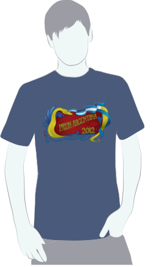

===========
Proveedores
===========

:Autor: Romina Castrogiovani
:Email: r.castrogiovani@gmail.com

La selección de proveedores
---------------------------

La búsqueda de proveedores arrancó en el mes de Marzo. La intención era tener al
menos 2 o 3 presupuestos para cada compra e ir teniendo una idea de los costos
que se debían afrontar.

Para la elección no en todos los casos era optar por el presupuesto más
económico; también se evaluó el hecho de que sea un proveedor conocido,
antecedentes de sus productos y su cumplimiento. El hecho de que tuviera envío
sin costo extra también nos favorecía, ya que no se contaba con gente ni tiempo
para hacer los retiros.

A partir de este punto, teniendo ya cierta idea de los gastos necesarios y los
gastos superfluos se comenzó a trabajar en un cashflow que nos ayudaría durante
todo el proceso a mantener los ingresos y egresos en equilibrio.

Los montos presupuestados fueron tomados con un 2 a 3 % de incremento por ajuste
inflacionario, ya que hasta el mes de agosto no se contaría con el efectivo
para efectuar las compras. También, en algunos casos, los organizadores
financiaron las compras para aprovechar los precios de principio de año.

Llegado Agosto se pidió a los proveedores seleccionados que re-enviaran
nuevamente sus presupuestos actualizados para así armar los pedidos.

El objetivo era tener una semana antes de la conferencia todo comprado y
reservado. Pero,a pesar de que se comenzó a trabajar con un tiempo
prudencial; hubo cuestiones que hicieron que los planes no se apegaran a lo
esperado, no por cuestiones de tiempo, no por improvisación, sino por eventos
que iban mas allá del alcance de la organización (se explicará este tema mas
adelante).

    Remera part edel bono contribución

Fondos extranjeros
------------------

El presupuestos de la conferencia resultaba bastante ajustado e imprevisible
en cuanto a la concreción o fecha de acreditación de algunos ingresos por ser
estos provenientes del extranjero, o en el caso del Fonsoft, que si se llegaba
dar, se sabría en días muy próximos a la conferencia o incluso pasada la misma.
Una precaución que se tuvo, respecto a estos ingresos muy dilatados, fue
asignarlos a gastos no esenciales.

Por estás razones se han tratado de negociar todos los precios. En algunos
casos se ha podido conseguir un precio intermedio entre los dos presupuestos, y
en otros simplemente se aceptó los incrementos inflacionarios.

Los pagos
---------

Todos nuestros planes funcionaban a la perfección, hasta que llegó el momento de
realizar los primeros pagos, es en este punto donde se complicaron realmente
las cosas en todos los niveles organizacionales.

El dinero estaba, pero había demoras en SoLAr para que salieran los pagos.

Con el tema de anticipos, una demora de una semana, no era problema; ya que
todo fue pedido con bastante tiempo de antelación y los plazos de entrega se
podían dilatar.

El tema crucial fue al momento de sacar el pago de los saldos cancelatorios
para recibir los productos y servicios. En esta instancia a las demoras
habituales se le sumó un problema de firmas, retrasando los pagos hasta mas
de una semana.

Esto produjo incomodidad con algunos proveedores. La mayoría,de todas formas,
tuvo muy buena voluntad entregandonos los materiales a pesar de no haberles
pagado. El retraso que más preocupación trajo fue el de la fiesta de cierre
en el Parque de la ceverceria Quilmes, ya que el saldo debía cancelarse una
semana antes del día de la fiesta. Y las remeras, sin el pago no había manera
de que nos las entregasen.

Lo perjudicial de esto, mas allá de la preocupación, fue que nos encontramos
corriendo durante la semana de conferencia, retirando cosas que podríamos haber
tenido con anterioridad y destinar ese tiempo a otras ocupaciones.

.. only:: html

    .. figure:: proveedores/cerv.jpg
        :align: center
        :scale: 30 %

        Parque de la Cervecería Quilmes (donde se realizó la fiesta de cierre)

.. only:: latex

    .. figure:: proveedores/cerv.jpg
        :align: center
        :scale: 80 %

        Parque de la Cervecería Quilmes (donde se realizó la fiesta de cierre)

Bono contribución: Merchandising y eventos sociales
---------------------------------------------------

Un tema extremadamente importante, fue el del merchandising y eventos sociales
del bono contribución; debido a la inflación constante y lo complicado de
estimar cantidades a pedir y lugares a reservar.

Los pedidos de mercadería se hicieron 20 días antes y el bono se pagó hasta el
día previo a la conferencia. Si bien se hicieron los pedidos teniendo en cuenta
un número mayor de unidades, nos encontramos que a una semana estabamos
quedandonos sin stock. Las reservas para la recepción y cena no eran un problema
porque hasta 1 día antes podíamos modificar el número de asistentes.

Se pudo hacer un nuevo pedido solo de los Mouse pad a último momento, pero pagando
un plus por la entrega inmediata.

Es por esto que antes de agotar stock se informó en el bono que algunos
productos estaban sujetos a disponibilidad, y en caso de faltante se
priorizaria la fecha de pago del bono.

Por suerte y por sorpresa, algunos pagaron el bono novato por el simple hecho
de "contribuir a la causa" y no retiraron su remera.

Resumiendo
----------

:Lo Bueno: A pesar de que parecía difícil poder ajustarse al presupuesto
           inicial, se logró sin necesidad de hacer sacrificios, el secreto, un
           cashflow bien hecho y actualizado a todo momento, considerando
           aumentos inflacionarios y distinguiendo entre efectivo corriente y
           no corriente, dejado este último destinado a gatos no prioritarios.

:Lo Malo: Se ha perdido tiempo por escuchar opiniones en disconformidad con la
          elección de algún producto o servicio, otorgando a los que
          plantearon su queja tiempo para que presenten alguna propuesta
          distinta. luego de lo cual nunca hubo una nueva propuesta, ni
          solución distinta.
:Lo Feo: Depender de una organización externa para trámites oficiales y
         manejo de fondos, resultó sumamente impráctico.
